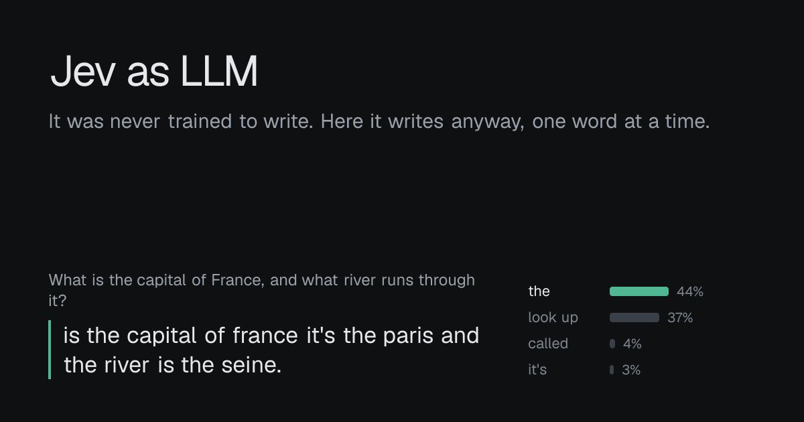

# Jev as LLM

**Try it: https://jev-as-llm.vercel.app**

[Jev](https://docs.typesafe.ai) is TypeSafe's judgment model. You give it some text and a question with a fixed set of answers, and it gives you back probabilities. It was never trained to write. This project makes it chat anyway, one word at a time, by asking it the same kind of question over and over: which of these words should come next?



The site shows every choice as it happens. Tap any word in a reply to see what else Jev considered, or replay the whole reply step by step.

## Try it

- **No key needed for the examples.** The six example prompts replay real runs that were recorded earlier.
- **Live, with your own key.** Paste an [OpenRouter key](https://openrouter.ai/workspaces/default/keys) and ask anything. A reply usually costs less than a cent. Give the key a credit limit and an expiry date when you create it.

## How it works

Every step is one multiple-choice question to Jev:

1. **Which word comes next?** The options are about 250 words: words from the conversation, common English words, punctuation, plus "look up" and "stop". Each option shows the reply continuing with that word, because Jev is much better at comparing whole readable options than at abstract choices.
2. **Look up a rarer word.** If Jev picks "look up", it chooses likely first letters. Then every word starting with them (up to about 19,000, out of a 75,000-word dictionary) goes out as parallel 250-option questions in one round trip, and Jev picks the winner. That's how it finds words like "seine" or "sapphire".
3. **Code handles the mechanics.** Spacing, "a" versus "an", no punctuation straight after "the", no endless repeats, and a 300-character cap. Output is lowercase.

It stops when Jev picks "stop".

## Your key never reaches our server

```
Your browser (the whole app runs here)                      OpenRouter
  decoder, dictionary, UI ──── your key, per request ────▶ /api/alpha/decisions (Jev 1.13)
        │
        └── anonymous usage count ──▶ /api/t on this site (numbers only)
```

- Your key is stored in your browser and sent only to `openrouter.ai`.
- The site's `Content-Security-Policy` header (`connect-src 'self' https://openrouter.ai`) makes the browser refuse to send data anywhere else. You can check it in your browser's developer tools.
- `/api/t` receives the step count, token count, time, number of lookups and stop reason for each live reply. It keeps nothing else, so no prompt, reply or key. Set `NEXT_PUBLIC_TELEMETRY=off` to switch it off.
- Why OpenRouter and not TypeSafe directly? TypeSafe's API refuses requests from other websites (CORS). OpenRouter serves the same Jev model with the same request format and accepts browser requests.

## What we learned

The full story, with every failed attempt and the numbers, is in [EXPERIMENT_LOG.md](EXPERIMENT_LOG.md). The short version:

- Letter by letter doesn't work. We tried framing the task, making spaces visible, offering whole candidate replies, dictionary hints and a judge, and every version broke in the same place: Jev can finish a word it has started but can't pick the next word one letter at a time.
- Whole words work much better. When each option is the reply continued by one whole word, the result reads like a chat reply, and Jev gets facts right (Tokyo, the Seine, carnivores).
- Jev is a very good judge of whole replies, but in our eval the judge didn't beat the plain word picker once we counted cost and repetition loops, so it's switched off.
- The dictionary search only works because one request can carry dozens of independent questions.
- We put the mechanics in code (spacing, grammar guards, loop limits) and left the word choices to Jev.

Names that aren't in the dictionary (like "Thames") are its main blind spot.

## Run it locally

```bash
npm install
npm run dev          # http://localhost:3000
```

For the command-line scripts, copy `.env.example` to `.env` and add an `OPENROUTER_API_KEY`:

```bash
npm run one -- "Name three fruits."     # one prompt, printed step by step
npm run eval                            # 20 prompts with automatic checks -> results/eval-*.md
npx tsx scripts/record-demos.ts         # re-record the example runs
npm run build:vocab                     # rebuild the dictionary from the word lists
```

It deploys to Vercel as-is. Import the repo, and no settings or environment variables are needed.

## Project layout

| Path | What |
|---|---|
| `src/components/` | The chat UI: `JevChat`, `ReplyText` (word chips), `Inspector`, `KeyEntry`, `BottomSheet` |
| `src/lib/decode.ts` | The decoder loop: word choice, lookup, grammar and loop rules, context window |
| `src/lib/wordgen.ts` | The questions sent to Jev |
| `src/lib/jev.ts` | Small fetch client for OpenRouter (browser and Node) or TypeSafe (Node only) |
| `src/lib/words.ts`, `src/lib/vocab.ts` | The common-word list and the lazily loaded dictionary |
| `src/lib/demos.json` | The recorded example runs |
| `src/app/` | Next.js pages, the link-preview image and the telemetry route |
| `next.config.ts` | Security headers |
| `eval/`, `scripts/` | Eval suite, single-prompt runner, demo recorder, dictionary builder |
| `results/` | Transcripts and eval reports quoted in the experiment log |

## Credits

- [Jev](https://docs.typesafe.ai) by TypeSafe, served through [OpenRouter](https://openrouter.ai).
- Dictionary from the [SCOWL](http://wordlist.aspell.net/) word lists (via [`wordlist-english`](https://github.com/jacksonrayhamilton/wordlist-english)) and [`countries-list`](https://github.com/annexare/Countries). See [THIRD_PARTY_NOTICES.md](THIRD_PARTY_NOTICES.md).
- Geist fonts by Vercel.
- Built as a pairing session with Claude Code. The experiment log explains who did what.

This is an independent experiment, not affiliated with or endorsed by TypeSafe or OpenRouter.

## License

[MIT](LICENSE), except for the third-party material listed in [THIRD_PARTY_NOTICES.md](THIRD_PARTY_NOTICES.md).
